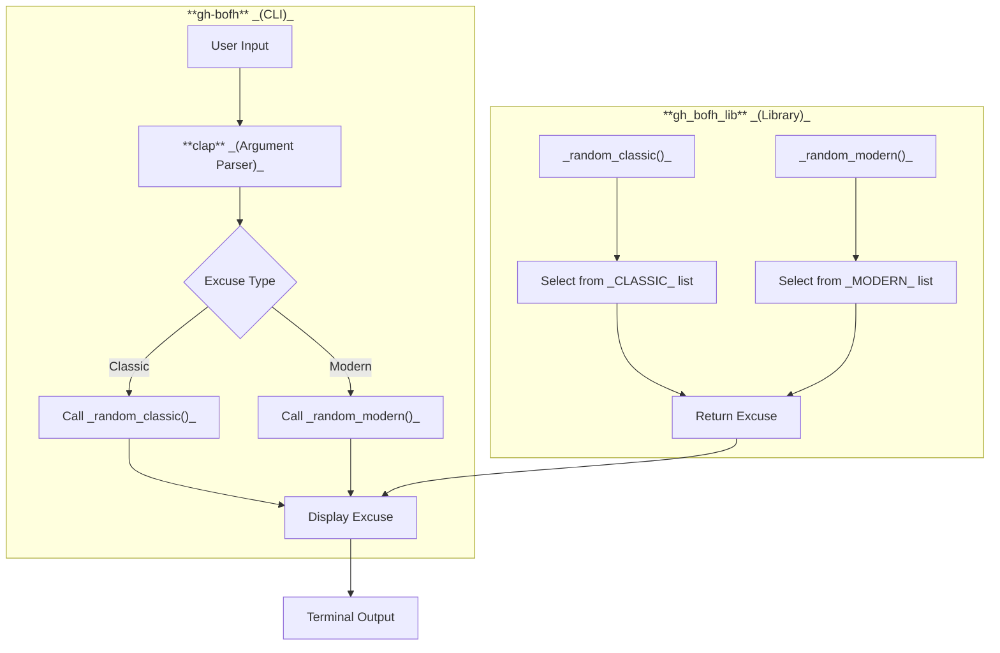

<!--
SPDX-FileCopyrightText: 2023 - 2025 Ali Sajid Imami

SPDX-License-Identifier: Apache-2.0
SPDX-License-Identifier: MIT
-->

# **Architecture Documentation**

## **Overview**

The `gh-bofh-rs` project is a GitHub CLI extension that generates random BOFH (Bastard Operator From Hell) excuses. The project consists of two main components:

1. **Library (`gh_bofh_lib`)**: A Rust library that provides the core functionality for generating random excuses and contains a list of pre-defined excuses.
2. **CLI (`gh-bofh`)**: A binary crate that acts as a command-line interface for the library, allowing users to generate excuses via the command line.

The project is designed to be modular, with clear separation between the library and the CLI. The library contains the logic for excuse generation, while the CLI handles user interaction and input parsing.

---

## **High-Level Design**

The architecture of the project can be visualized as follows:



---

## **Components**

1. **`gh-bofh` (CLI)**:
   - **Purpose**: Provides a command-line interface for generating random BOFH excuses.
   - **Dependencies**:
     - `clap`: A Rust library for parsing command-line arguments.
     - `gh_bofh_lib`: The core library for generating excuses.
   - **Functionality**:
     - Parses user input (e.g., excuse type: classic or modern).
     - Calls the appropriate function from `gh_bofh_lib` to generate an excuse.
     - Displays the generated excuse to the user.

2. **`gh_bofh_lib` (Library)**:
   - **Purpose**: Provides the core functionality for generating random BOFH excuses.
   - **Dependencies**:
     - `rand`: A Rust library for random number generation.
   - **Functionality**:
     - Contains two static arrays of excuses: `CLASSIC` and `MODERN`.
     - Provides functions (`random_classic` and `random_modern`) to randomly select an excuse from the respective list.
     - Returns the selected excuse as a string slice.

---

## **Data Flow**

1. **User Interaction**:
   - The user runs the `gh-bofh` CLI with optional arguments (e.g., `--classic` or `--modern`).
   - The CLI parses the arguments using `clap` and determines the type of excuse to generate.

2. **Excuse Generation**:
   - The CLI calls the appropriate function from `gh_bofh_lib` (`random_classic` or `random_modern`).
   - The library randomly selects an excuse from the predefined list (`CLASSIC` or `MODERN`) and returns it to the CLI.

3. **Output**:
   - The CLI displays the generated excuse to the user in the terminal.

---

## **Dependencies**

- **`clap`**: Used for parsing command-line arguments in the CLI.
- **`rand`**: Used for random number generation in the library.

---

## **Example Workflow**

```bash
$ gh-bofh --modern
The cloud provider is experiencing an outage.
```

---

## **Explanation**

1. The user runs the command `gh-bofh --modern` in the terminal.
2. The CLI parses the `--modern` argument and calls the `random_modern()` function from the `gh_bofh_lib` library.
3. The library randomly selects an excuse from the `MODERN` list and returns it.
4. The CLI prints the selected excuse to the terminal, as shown in the output above.
